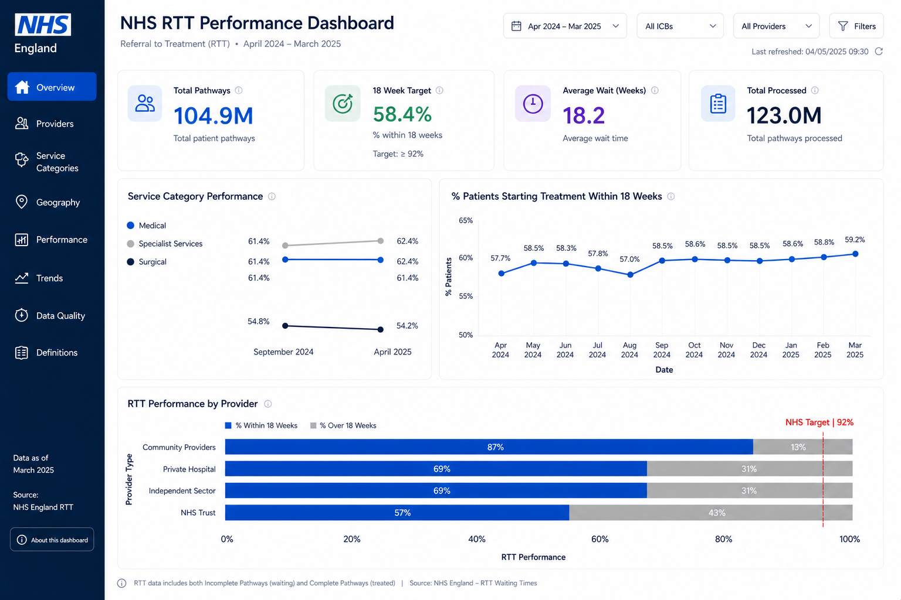
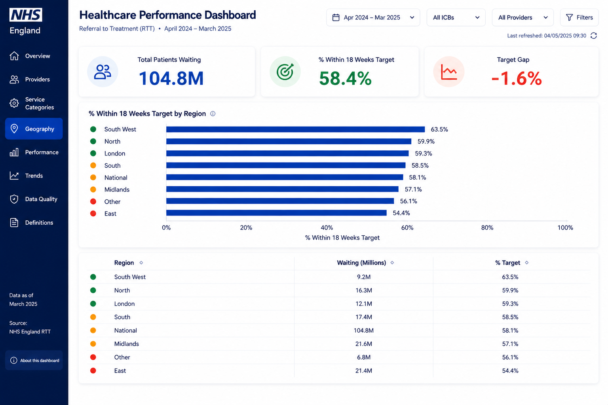
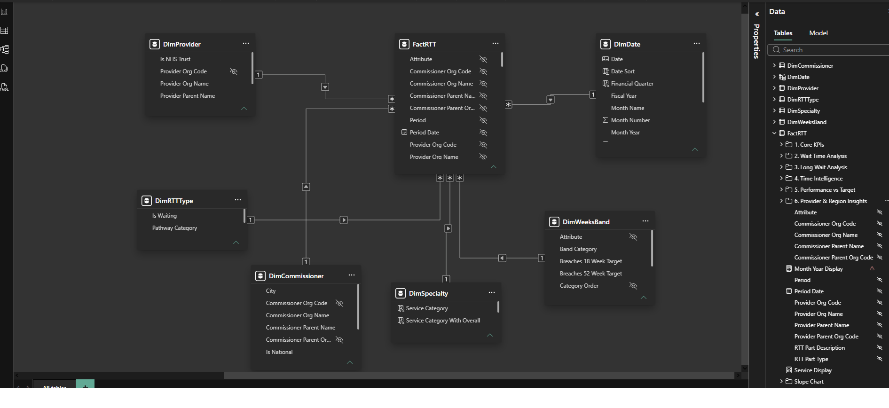

# NHS RTT Waiting List Analytics Dashboard

**A quantitative analysis of the Independent Sector opportunity in NHS waiting list management**

---

## Dashboard Preview



*Overview page showing core KPIs: 104.8M patients waiting, 58.4% within 18-week target, 18.2 weeks average wait*



*Geography page showing regional variation: South West leads at 63.5%, East trails at 54.4%*

---

## Overview

This repository contains an end-to-end data analytics project analyzing 12 months of NHS England Referral-to-Treatment (RTT) waiting list data (April 2024 – March 2025) across 479 providers and 23 medical specialties.

**Core Finding:** Independent Sector providers achieve **68.9% compliance** with the 18-week target versus **57.3%** at NHS Trusts — an **11.5 percentage point gap** — despite handling only **5.9%** of total patient volume. This represents a quantifiable opportunity to reduce NHS waiting lists through strategic capacity reallocation.

---

## The Business Question

> **What opportunity exists to reduce the NHS waiting list by shifting more volume to Independent Sector providers?**

### Key Metrics
- **Total pathways analyzed:** 123.0M  
- **Patients currently waiting:** 104.9M  
- **System compliance (18-week target):** 58.4% (target: 92%)  
- **Gap to target:** 33.6 percentage points  
- **Projected impact (5.9% → 15% Independent share):** ~2.8M fewer 18-week breaches annually

---

## Project Scope

| Aspect | Detail |
|--------|--------|
| **Data period** | April 2024 – March 2025 (12 months) |
| **Source** | NHS England RTT Public Data |
| **Providers** | 479 (NHS Trusts + Independent Sector) |
| **Specialties** | 23 medical treatment functions |
| **Rows (fact table)** | 14.0M patient-pathway records |
| **Fact rows (cleaned)** | 12.8M (9.4% exclusion rate) |

---

## What's Included

### 📊 Dashboard
- **3-page interactive Power BI dashboard** (Figma-designed wireframes, custom theme)
- **30+ DAX measures** across 6 thematic folders
- **10 calculated columns** for time-banding and segmentation
- **What-If parameter** for scenario modelling (Independent share from 5% to 30%)
- **Custom colour palette** aligned to NHS brand guidelines

### 📋 Documentation
1. **Executive Summary** — project objectives, scope, key findings
2. **Data Dictionary** — all fields, types, business logic
3. **Exclusion Log** — what was filtered and why (9.4% of rows)
4. **Data Model** — star schema (7 tables, 6 relationships)
5. **DAX Measures** — full catalogue with formulas and live values
6. **Insights Catalogue** — 40+ findings grouped by tier (headline, supporting, diagnostic)
7. **Technical Build Guide** — Figma → Power BI workflow with pixel-level coordinates
8. **Limitations & Caveats** — what the data does and doesn't show

### 🛠️ Code & Data
- **Power BI model** (`.pbix`) — star schema with all measures and formatting applied

- **Power Query transformations** — cleaning, de-duplication, exclusion logic
- **DAX formulas** — time intelligence, conditional logic, What-If integration

---
## Technical Stack

**Data Processing & Modelling:**
- SQL (data cleaning, filtering, exclusion logic)
- Power Query (ETL, transformation, de-duplication)
- DAX (time intelligence, What-If parameters, RLS-ready structure)

**Visualisation & Design:**
- Figma (wireframe design, component system, pixel-perfect layout)
- Power BI Desktop (data model, measures, formatting, publishing)
- Power BI Service (dashboard hosting, sharing)

**Documentation:**
- Markdown (this README, technical specs)
- PDF (Figma wireframes, Build Guide)
- JSON (Power BI theme definition)

---

## Data Model

**Star Schema Structure:**
```
FactRTT (14.0M rows)
├── DimDate (365 days)
├── DimProvider (479 providers)
├── DimSpecialty (23 specialties)
├── DimWaitBand (6 wait-time bands)
├── DimCommissioner (129 ICBs/regions)
└── DimRTTType (2 pathway types)
```

**Key Dimensions:**
- **DimProvider:** Provider name, type (NHS Trust / Independent Sector), region, ICB
- **DimSpecialty:** Treatment function name, code, category
- **DimWaitBand:** Constructed from calculated days_waiting (0–17, 18–25, 26–51, 52–103, 104–365+)
- **DimDate:** Month, quarter, fiscal year, year-to-date flags

**Fact Table Logic:**
- One row = one patient's waiting status in one calendar month
- Patient-months retained; patients counted monthly (not deduplicated by person)
- Exclusions applied: C_999 code, future-dated records, data quality flags

---

## Key Insights

### Tier 1 — Headline
1. **The 33.6pp gap:** System sits at 58.4% compliance vs 92% target — roughly 1 in 3 patients breaches
2. **System at the edge:** Average wait is exactly 18.2 weeks (at breach threshold with no safety margin)
3. **The Independent sector opportunity:** 11.5pp compliance advantage despite 5.9% volume share

### Tier 2 — Supporting
4. **Outpatient dominance:** 79% of completions are non-admitted; bed capacity planning alone insufficient
5. **Regional variation:** East (54.4%) vs East Midlands (63.7%) — 9.3pp spread, actionable target
6. **Specialty concentration:** T&O (53.2%), General Surgery (54.1%), ENT (54.3%) account for 26% of breaches

### Tier 3 — Diagnostic
7. **Two-year waiters (104+):** 17,160 patients — NHS's hardest chronic breaches
8. **Long-term trend stability:** Independent compliance remains ~11.5pp ahead month-to-month
9. **Volume vs performance trade-off:** High-volume trusts (300K+ patients) = lower compliance

**Full insights catalogue (40+ findings) in `INSIGHTS_AND_RECOMMENDATIONS.md`**

---

## Recommendations

1. **Shift Independent share from 5.9% to 15%**  
   → Closes ~8% of the gap to target  
   → Avoids ~2.8M breaches annually  
   → Achievable without new NHS capacity investment

2. **Focus on three underperforming specialties:**  
   - T&O: shift 20% volume to Independent  
   - General Surgery: 15% shift  
   - ENT: 18% shift  

3. **Target East region as pilot**  
   - Worst performer (54.4% compliance)  
   - Smallest regional population  
   - Fastest to demonstrate impact

4. **Establish Independent-NHS collaboration model**  
   - Agreed pathways for referral escalation  
   - Outcome tracking (did Independent completions reduce NHS waiting for others?)  
   - Quality parity requirements

---

## Limitations & Caveats

- **Patient-months, not unique patients:** Same person counted monthly; longitudinal de-duplication not possible at source
- **No outcome data:** Model shows waiting times, not treatment effectiveness or patient outcomes
- **Independent data quality:** Smaller provider sample; some specialties under-represented
- **No cost data:** Recommendations assume Independent capacity is available and cost-neutral relative to NHS
- **Snapshot analysis:** One fiscal year; seasonal trends may differ in future cycles

See `LIMITATIONS.md` for full detail.

---
## Project Metrics

| Dimension | Value |
|-----------|-------|
| **Total pathways** | 123,049,166 |
| **Time period** | April 2024 – March 2025 |
| **Providers** | 479 (NHS Trusts + Independent) |
| **Specialties** | 23 treatment functions |
| **Regions** | 8 ICB regions |
| **DAX measures** | 30+ across 6 folders |
| **Calculated columns** | 10 helper columns |
| **Dashboard pages** | 3 (Figma-designed) |
| **Figma components** | 12-column grid, 8 content zones per page |
| **Design spec pages** | 15 (Build Guide + Wireframes) |
| **Insights documented** | 40+ (Tier 1, 2, 3) |

---

## License

MIT License — Use this project freely for learning and portfolio purposes.

---

## Questions & Feedback

This project was built as a **portfolio piece** to demonstrate end-to-end analytical thinking and technical execution. If you have feedback on the analysis, the model, or the presentation, feel free to open an issue.

---

**Last updated:** May 2026  
**Data period:** April 2024 – March 2025  
**Data source:** NHS England RTT Public Data
